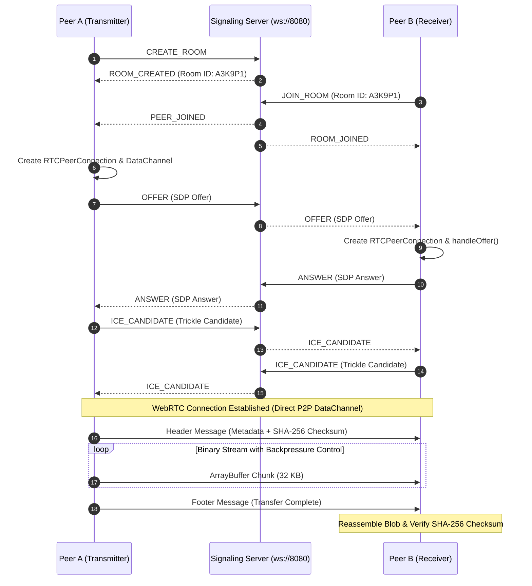

# P2P Drop

Zero-server browser-to-browser file sharing powered by native WebRTC DataChannels and custom WebSocket signaling.


---

## Demo

### Screenshots


### Video Walkthrough
https://github.com/user-attachments/assets/b8a63046-4dad-4f4a-8cf7-9ec1867bca63

---

## The Problem

Traditional file-sharing services force users to upload files to a third-party cloud server first before the recipient can download them. This double-transfer approach introduces massive upload wait times, exposes private files to server storage risks, and incurs costly infrastructure overhead for large files. **P2P Drop** solves this by establishing a direct, encrypted WebRTC DataChannel connection between two browsers, allowing arbitrary binary files to stream peer-to-peer in real time with zero server storage and zero upload waiting.

---

## How It Works

1. **Signaling Handshake**: Peer A creates a room on the lightweight WebSocket signaling server (`ws://localhost:8080`), generating a 6-character room frequency code.
2. **Peer Pairing**: Peer B joins the room code. The signaling server relays SDP Offers, SDP Answers, and Trickle ICE candidates between the two peers to negotiate network traversal (STUN).
3. **P2P DataChannel Takeover**: Once the WebRTC `RTCPeerConnection` transitions to `connected`, the signaling server steps aside completely.
4. **Binary Chunk Streaming**: Peer A slices the staged file into 32 KB binary ArrayBuffer chunks and streams them directly over the `RTCDataChannel` to Peer B.
5. **Assembly & Hash Verification**: Peer B reassembles the chunks into an in-memory `Blob` and verifies the payload against Peer A's pre-computed SHA-256 checksum via the Web Crypto API.



---

## Architecture Diagram

```
P2P-Drop/
├── client/                     # React + Vite + TypeScript Frontend
│   ├── src/
│   │   ├── components/
│   │   │   ├── SenderView.tsx         # Local Transmitter Node UI (Amber theme & dropzone)
│   │   │   ├── ReceiverView.tsx       # Remote Receiver Node UI (Teal theme & download trigger)
│   │   │   ├── SignalWaveform.tsx     # HTML5 Canvas Oscilloscope Waveform
│   │   │   └── DiagnosticsDrawer.tsx  # Telemetry Readout Drawer (getStats() polling)
│   │   ├── services/
│   │   │   ├── webrtcManager.ts       # Core WebRTC DataChannel engine & backpressure logic
│   │   │   └── signaling.ts           # WebSocket Client Service
│   │   ├── utils/
│   │   │   └── crypto.ts              # Web Crypto SHA-256 calculation utility
│   │   ├── types/
│   │   │   └── webrtc.ts              # TypeScript interfaces for signaling & stats
│   │   ├── App.tsx                    # Dual-zone orchestration & roleRef sync
│   │   └── index.css                  # Direct Signal design system & tokens
│   ├── index.html                     # Entry HTML (Space Mono & Inter fonts)
│   └── vite.config.ts                 # Vite + TailwindCSS v4 configuration
└── server/                     # Lightweight Node.js Signaling Server
    ├── src/
    │   └── index.ts                   # WebSocket room matching & offer/answer relay
    └── package.json                   # ws & tsx server dependencies
```

---

## Tech Stack

- **Frontend Core**: React 19, TypeScript, Vite
- **Styling & Design**: TailwindCSS v4, Lucide React, Space Mono & Inter Google Fonts
- **Signaling Layer**: Node.js, `ws` (WebSocket server), `tsx`
- **P2P Protocols & Web APIs**:
  - WebRTC (`RTCPeerConnection`, `RTCDataChannel`)
  - Web Crypto API (`crypto.subtle` SHA-256)
  - HTML5 Canvas API (oscilloscope waveform rendering)
  - Google Public STUN Servers (`stun:stun.l.google.com:19302`)

---

## Features

- **Pure Native WebRTC Implementation**: Built directly against standard browser WebRTC APIs without high-level abstraction wrappers like PeerJS.
- **Custom WebSocket Signaling Protocol**: Lightweight JSON message broker managing 6-character room matching, SDP Offer/Answer exchanges, and Trickle ICE candidate relaying.
- **DataChannel Backpressure Engine**: Dynamically monitors `bufferedAmount` and `bufferedAmountLowThreshold` to stream multi-gigabyte files without crashing browser heap memory.
- **Bit-Perfect SHA-256 Integrity Check**: Calculates cryptographic SHA-256 hashes pre-transfer and post-reassembly to guarantee zero payload corruption.
- **Live Oscilloscope Canvas Waveform**: An HTML5 Canvas wave beam that dynamically modulates amplitude in near-real-time based on live transfer speed (`throughputBps`).
- **Real-Time Telemetry Readout**: Queries `RTCPeerConnection.getStats()` to display candidate pair types (`HOST`, `SRFLX`, `RELAY`), RTT latency (ms), and active transport protocols.
- **"Direct Signal" Aesthetics**: Dual-zone layout contrasting Local Transmitter (Signal Amber `#E8A33D`) against Remote Receiver (Signal Teal `#4FD1C5`) over a deep warm charcoal backdrop (`#16151A`).
- **QR Code Pairing**: Instant mobile camera QR scanning to join room frequency links.

---

## Getting Started

### Prerequisites
- Node.js (v18 or higher)
- npm (v9 or higher)

### Installation
```bash
# Clone the repository
git clone https://github.com/pranjal9091/P2P-Drop.git
cd P2P-Drop

# Install dependencies for server and client
cd server && npm install
cd ../client && npm install
cd ..
```

### Running Locally
Run the signaling server and client development server in two separate terminal windows:

```bash
# Terminal 1: Start Signaling Server (ws://localhost:8080)
npm run dev:server

# Terminal 2: Start Vite Client (http://localhost:5173)
npm run dev:client
```

### Testing P2P Transfer Between Two Browser Windows
1. Open `http://localhost:5173/` in **Browser Window 1 (Sender)**.
2. Drag and drop any file into the `LOCAL TRANSMITTER` zone.
3. Click **GENERATE TRANSMISSION FREQUENCY** to create a 6-character room code (e.g. `A3K9P1`).
4. Copy the generated frequency link or note the code.
5. Open an **Incognito Window / Second Browser (Receiver)** and paste the frequency URL (`http://localhost:5173/#room=A3K9P1`) or type the code into the `REMOTE RECEIVER` prompt.
6. The status will update to **`SIGNAL: CONNECTED`** and **`BEAM LOCKED`**.
7. The file streams automatically peer-to-peer over the `RTCDataChannel`.
8. Once complete, click **SAVE RECEIVED PAYLOAD TO DISK** on the Receiver to save the verified file.

---

## Key Engineering Challenges

### 1. Preventing Browser Memory Exhaustion on Large File Transfers (Backpressure Control)
Streaming multi-gigabyte files directly over `RTCDataChannel` can rapidly overflow browser memory if data is pushed faster than the underlying socket can send. 
- **Solution**: Implemented a flow control engine in `webrtcManager.ts` that tracks `dataChannel.bufferedAmount`. When the buffer exceeds 1 MB (`BUFFER_HIGH_WATERMARK`), the sender pauses file reading (`Blob.slice()`) until the `onbufferedamountlow` event fires at 64 KB (`BUFFER_LOW_WATERMARK`), maintaining a stable memory footprint regardless of file size.

### 2. Eliminating Trickle ICE Candidate Race Conditions
In WebRTC, ICE candidates can arrive via signaling before `setRemoteDescription()` has finished executing on the remote peer, causing browsers to throw an `InvalidStateError`.
- **Solution**: Designed an asynchronous candidate buffer (`pendingIceCandidates`). Incoming candidates received during handshake are queued and flushed sequentially only after `remoteDescriptionSet` becomes `true`.

### 3. Asynchronous React State Staleness in WebSocket Event Listeners
Because WebSocket event listeners in React are often registered during initial mounting, callbacks can trap stale state values (e.g., `role` staying `null`), causing incoming SDP Offers or Answers to be ignored.
- **Solution**: Introduced a synchronized mutable reference (`roleRef = useRef<Role | null>(null)`). The WebSocket message handler checks `roleRef.current` synchronously, bypassing React closure state traps and ensuring SDP offers and answers are processed reliably.

### 4. Real-Time Oscilloscope Canvas Waveform Rendering
To visually represent peer-to-peer throughput without triggering costly DOM re-renders 60 times per second, the UI uses an HTML5 Canvas element.
- **Solution**: The canvas runs a lightweight `requestAnimationFrame` loop that computes harmonic sine wave equations. The amplitude is modulated dynamically based on real-time byte throughput (`throughputBps`) polled from `RTCPeerConnection.getStats()`.

---

## Limitations & Roadmap

### Current Limitations
- **Concurrent Availability**: Both peers must be online simultaneously for the direct transfer to take place.
- **NAT Traversal**: Uses public Google STUN servers (`stun.l.google.com:19302`) for host and server-reflexive NAT traversal. Direct connection establishment may fail on strict symmetric corporate NATs requiring a TURN relay.

### Future Roadmap
- [ ] Add optional TURN server relay fallback (via Coturn) for enterprise symmetric NAT networks.
- [ ] Implement multi-file and directory folder structure streaming over a single DataChannel stream.
- [ ] Support Web Streams API (`FileSystemWritableFileStream`) for direct disk-streaming of 10GB+ files without relying on Blob memory buffers.

---

## License

This project is licensed under the [MIT License](LICENSE).
